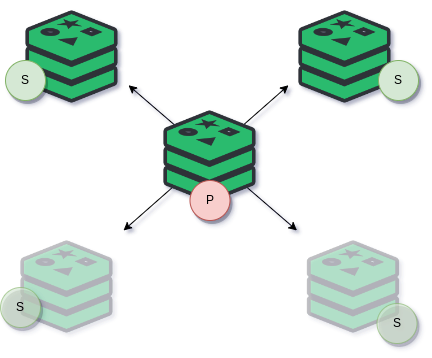

# Linode Marketplace Redis Sentinel Cluster



Create a highly available Redis cluster using [Redis Sentinel](https://redis.io/docs/management/sentinel/) through the [Linode Ansible Collection](https://github.com/linode/ansible_linode) through the Linode Marketplace. Redis is an open-source, in-memory, data-structure store, with the optional ability to write and persist data to a disk, which can be used as a key-value database, cache, and message broker. Redis features built-in transactions, replication, and support for a variety of data structures such as strings, hashes, lists, sets, and others. 


## Software Included

| Software  | Version   | Description   |
| :---      | :----     | :---          |
| Redis     | 7.07    | In-memory key value store |
| Redis Sentinel    | 7.0.7   | Redis process that provides high availability to the Redis cluster. It performs automatic primary promotion within the cluster |
| Firewalld     | 0.9.3-2       | Firewall utility to enforce exclusive network communication within the cluster  |


**Supported Distributions:**
- Ubuntu 22.04 LTS

## Documentation

Deployment guide:
- [Deploying a Redis Sentinel cluster throught the Linode Marketplace](https://www.linode.com/docs/products/tools/marketplace/guides/redis-cluster/)

Additonal resources:

- [Redis Sentinel](https://redis.io/docs/management/sentinel/)

## Post Deployment

Once the provisioning of the cluster is complete, you can find the credentials to access cluster on the first Redis node. The file will be in the home directory of the sudo user that was created:

`/home/admin/.deployment-secrets.txt`:
```
# system user 
      
user: admin
password: eX4_&mpl3Ep_Pa55worD!!

# redis password
redis-cli --askpass:
eX4_&mpl3Ep_Pa55worD!!
```

## Contributing
Contributions are welcome! Please generally adhere to the [sample directory layout](https://docs.ansible.com/ansible/latest/user_guide/sample_setup.html#sample-ansible-setup) and best practices/recommondations from the latest Ansible [User Guide](https://docs.ansible.com/ansible/latest/user_guide/index.html).

Please read the [developement guidelines](docs/DEVELOPMENT.md) for help with setting up a development environment and the [contributing guidelines](docs/CONTRIBUTING.md) for help creating your first Pull Request.

## Reaching Out
To report a bug or request a feature, please open a GitHub Issue. For general feedback, use feedback@linode.com.

## Author

- Elvis Segura (@n0vabyte)